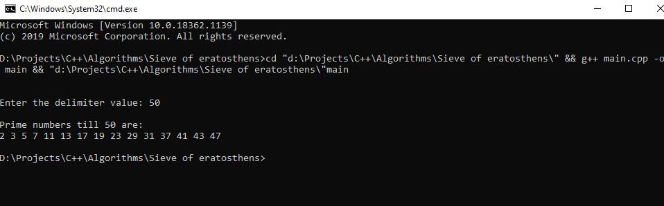

# Sieve of Eratosthenes

## Logic behind the Sieve of Eratosthenes algorithm

Sieve of Eratosthenes algorithm to find all the prime numbers till 'n'. It is most efficient way to find all primes smaller than 'n'. It is super optimised and can handle upto 10 million numbers at a time. 

Time Complexity: O(sqrt(n));

## Output for the code

## Algorithm

>1. Create array integers from 2 to n
##
>2. Initially, let p=2, the first prime number
##
>3. Loop: (p=2 ; p*p<=n ; p++>)
##
>4. if(prime[p] == true)
##
>5. for(i=p*p ; i<=n ; i=i+p)
##
>> prime[i] = false;
##
>6. Repeat for entire loop from step (3)

### Thanks For Reading

